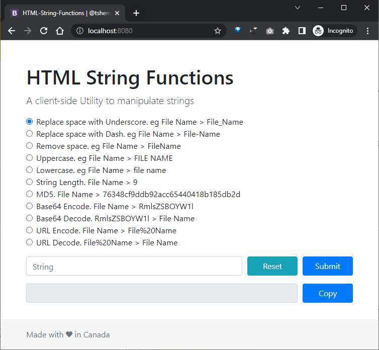

# html-stringfunctions


A client-side Utility to manipulate strings



### Motivation
There are lots of online tools to manupilate strings but the issue is some of them are possibly saving people's data on their servers. This tool runs on the client's browser and does not send data to any backend server.

### Features:
- Replace space with Underscore. eg File Name > File_Name
- Replace space with Dash. eg File Name > File-Name
- Remove space. eg File Name > FileName
- Uppercase. eg File Name > FILE NAME
- Lowercase. eg File Name > file name
- String Length. eg File Name > 9
- MD5. eg File Name > 76348cf9ddb92acc65440418b185db2d
- Base64 Encode. eg File Name > RmlsZSBOYW1l
- Base64 Decode. eg RmlsZSBOYW1l > File Name
- URL Encode. eg File Name > File%20Name
- URL Decode. eg File%20Name > File Name

## Usage
Open your terminal/command line and execute the following commands:
1. Clone the repository
```
$ git clone https://github.com/tshenolo/html-stringfunctions.git  
```  
2. Navigate to the html-stringfunctions folder
```
$ cd html-stringfunctions/src
```
3. Pick any of the following options:   
    - Using PHP's built-in Web Server
    ```
    php -S localhost:8080
    ```
    - Using Node.js local HTTP server
    ```
    npm install -g http-server
    ```
    ```
    http-server
    ```
    - Using Python local HTTP server
    ```
    python -m http.server 8080
    ```

Open your browser and navigate to localhost:8080

## Docker
### Build the Docker Image
Open a terminal, navigate to the directory containing your Dockerfile, and execute the following command
```bash
docker build -t html-stringfunctions .
```

### Run the Docker Container
After the image is built, run a container from it with the following command
```bash
docker run -d -p 8080:80 html-stringfunctions
```

Open your browser and navigate to localhost:8080


## TODO: Add the following features
- [x] Dockerize application
- [ ] Remove special characters
- [ ] others... (feel free to get in touch for a feature request)


## Support
If you like this project please don't be shy to:

<a href="https://www.buymeacoffee.com/tshenolo"></a>


